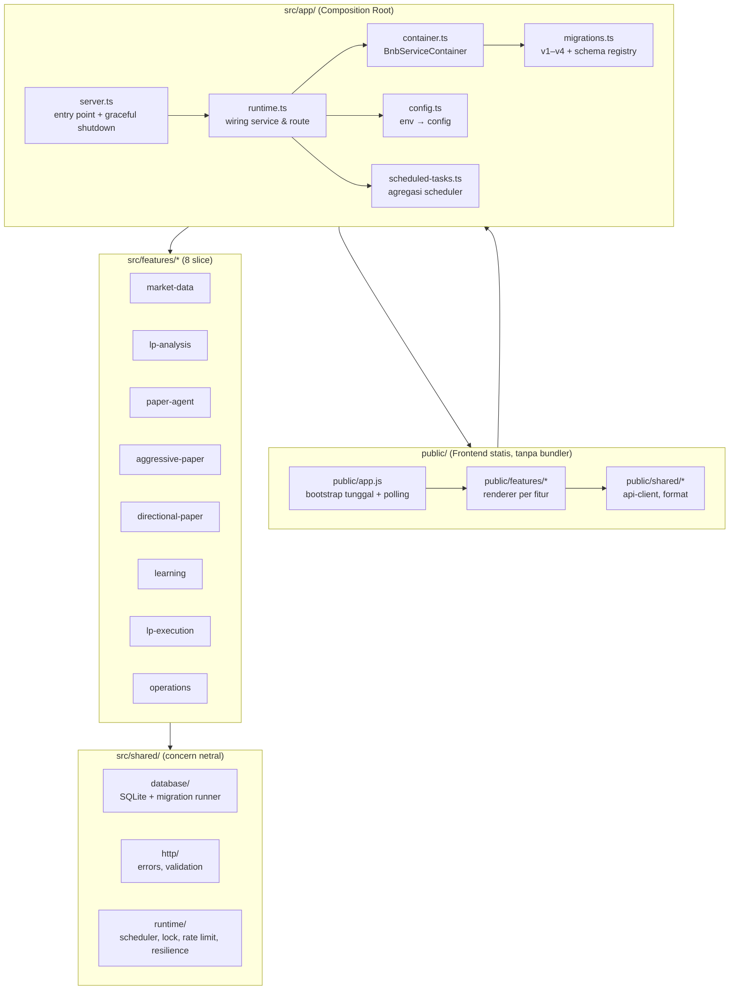
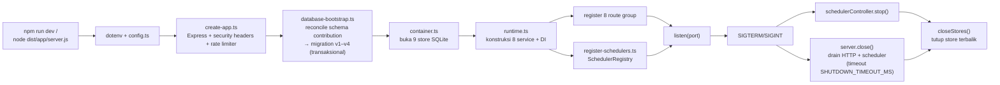
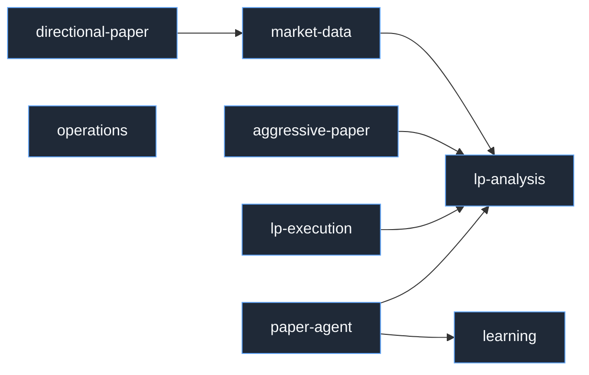
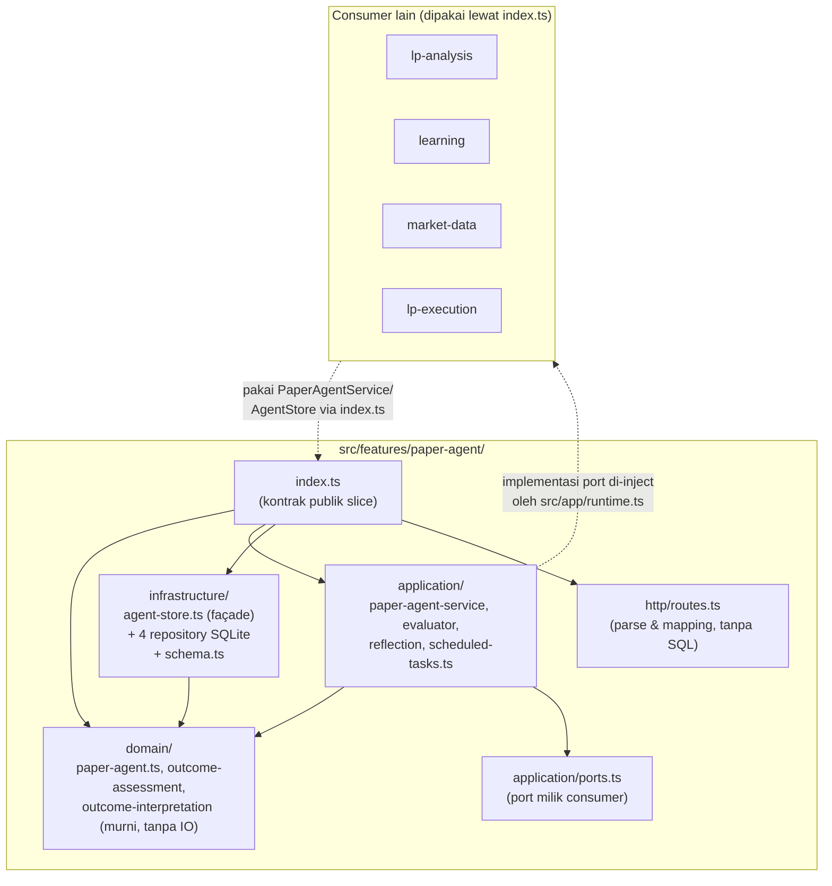
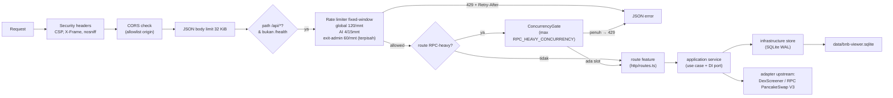
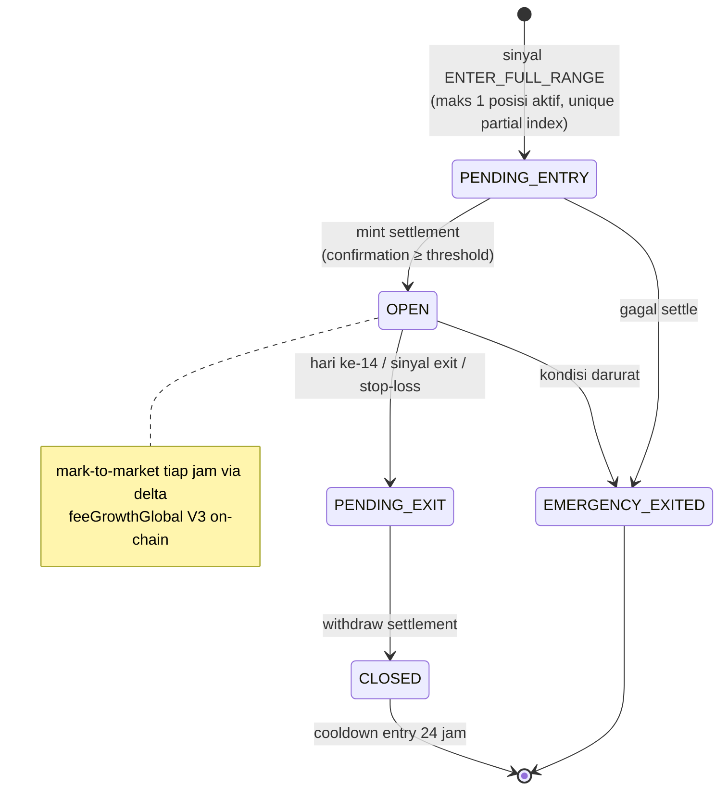
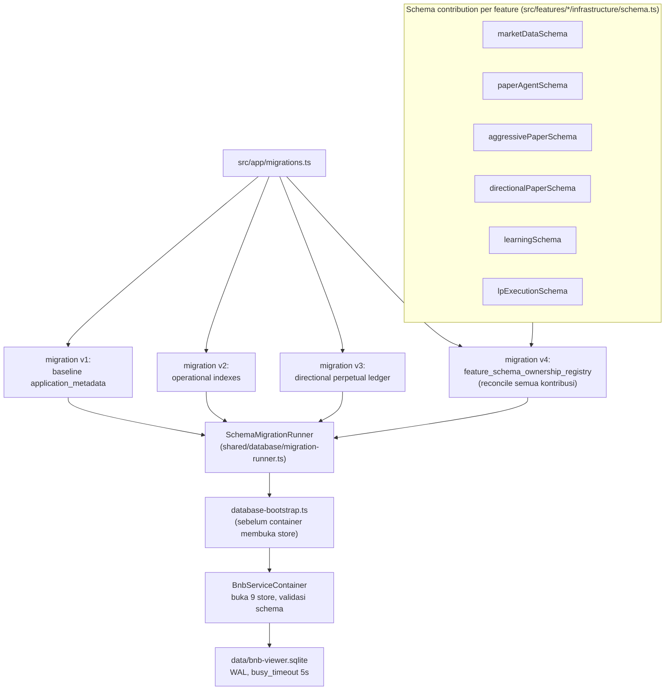
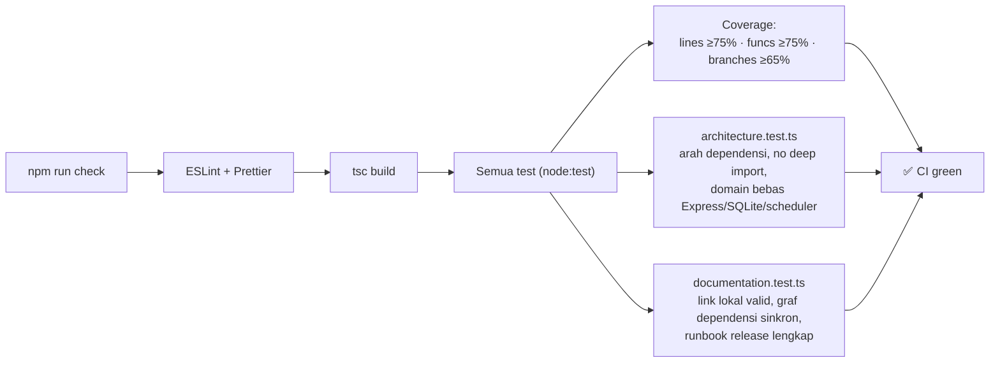

# Visualisasi Arsitektur (Mermaid)

Diagram arsitektur `bnb-lp-analyzer` dalam format Mermaid. Preview di editor yang
mendukung Mermaid (VS Code + extension, GitHub, Typora, atau
[mermaid.live](https://mermaid.live)).

Ringkasan tekstual: [`architecture.md`](architecture.md) ·
Keputusan arsitektur: [`adr/0001-vertical-slice-modular-monolith.md`](adr/0001-vertical-slice-modular-monolith.md) ·
Graf dependensi: [`feature-dependency-graph.md`](feature-dependency-graph.md)

---

## 1. Lapisan Utama & Arah Dependensi

---

## 2. Startup & Lifecycle Proses

---

## 3. Graf Dependensi Runtime Antar-Slice

Edge divalidasi oleh `src/architecture.test.ts`; graf wajib acyclic.

Catatan: pembacaan on-chain dimiliki `market-data`; primitive LP/lifecycle cost dimiliki
`lp-analysis`; orchestration paper-position diinjeksikan `app` → `paper-agent` sehingga
tidak ada edge balik ke `lp-execution`. Ada juga edge type-only (lihat
[`feature-dependency-graph.md`](feature-dependency-graph.md)).

---

## 4. Struktur Internal Satu Slice (contoh: `paper-agent`)

Pola yang sama berlaku untuk semua slice: `domain/` murni, `application/` orkestrasi,
`infrastructure/` SQLite & adapter, `http/` route.

---

## 5. Scheduler & Task Periodik

```mermaid
flowchart LR
    subgraph F["Tiap feature mengekspor ScheduledTaskDefinition"]
        T1["market-data tasks (1m)"]
        T2["paper-agent: paper-lifecycle,<br/>paper-outcome (1m), reflection (1h)"]
        T3["aggressive-paper tasks"]
        T4["directional-paper tasks (1m)"]
        T5["learning tasks"]
        T6["lp-execution tasks"]
        T7["operations tasks"]
    end

    A["src/app/scheduled-tasks.ts<br/>agregasi + sort registrationOrder"] --> R["SchedulerRegistry<br/>(shared/runtime)"]

    F --> A

    R --> S["run(name, task)"]
    S --> G{"sudah RUNNING?"}
    G -- "ya" --> H["skip: ALREADY_RUNNING<br/>(+1 skippedAlreadyRunning)"]
    G -- "tidak" --> I["eksekusi + catat status/<br/>lastSuccess/lastError/duration"]
    I --> J["readiness critical?<br/>→ /api/health/ready"]
    R --> K["waitForIdle(timeout)<br/>saat shutdown"]
```

---

## 6. Alur HTTP Request

---

## 7. Position Lifecycle (State Machine, `lp-execution`)

---

## 8. Database & Migration

---

## 9. Guardrails Otomatis (CI)

